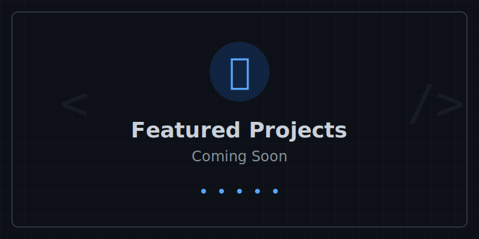

<!-- markdownlint-disable MD033 MD041 -->
<div align="center">
  

  # Hey there, I'm Jay Dubinsky 👋
  ### Technical Product Leader | Customer Experience Strategist | AI Enthusiast

  <p>
    <a href="https://www.linkedin.com/in/yajdotnet/">
      
    </a>
    <a href="https://cal.com/yajdotnet">
      
    </a>
  </p>
</div>

---

## 🚀 About Me

I'm a **techie at heart with a passion for business**. Throughout my career, I've founded technology companies and led Customer Success, Customer Experience, and Product Management organizations of various sizes.

My passion lies in leveraging advanced technologies to deliver exceptional end-user products and experiences that solve complex challenges.

### 🎯 Core Competencies

```text
💼 Technical Product Management    👥 Customer Success & Experience
🎨 UI/UX & Product Strategy        📊 Business Intelligence & Analytics
🤖 AI Implementation & Governance  💻 Software Engineering
🏗️  Software Architecture & DevOps 🐧 Linux System Engineering
```

---

## 🛠️ Tech Stack

### Languages & Frameworks


### Database & Data Warehousing


### Cloud & Infrastructure


### AI & Tools


### Business & Product Tools


---

## 🌱 Current Focus

- 🤖 **AI Integration & Governance** - Implementing AI solutions with responsible governance frameworks
- 📊 **Data-Driven Product Strategy** - Leveraging analytics to drive product decisions
- 🚀 **Scaling Customer Success** - Building repeatable, scalable customer experience programs
- 🎓 **Continuous Learning** - Exploring emerging technologies and best practices

---

## 🚀 Featured Projects

<div align="center">
  
</div>

---

## 📈 Areas of Expertise

<details>
<summary><b>Product Management & Strategy</b></summary>
<br>

- Agile & Scaled Agile Framework (SAFe)
- Product Roadmapping & Lifecycle Management
- Go-to-Market Strategy
- UI/UX Design & User Stories
- Product Launch & Growth
</details>

<details>
<summary><b>Customer Success & Experience</b></summary>
<br>

- Customer Journey Mapping
- Customer Onboarding & Retention
- Customer Data Platform (CDP) Implementation
- Scaled Customer Success Operations
- Global Support & Service Delivery
</details>

<details>
<summary><b>Technical & Engineering</b></summary>
<br>

- Software Architecture & Development
- DevOps & CI/CD
- Cloud Infrastructure (AWS, Azure, GCP)
- Database Administration
- Network Engineering
- System Architecture
</details>

<details>
<summary><b>Leadership & Operations</b></summary>
<br>

- Cross-functional Team Leadership
- Business Strategy & Development
- Process Improvement & SOPs
- Risk Management
- Strategic Partnerships
- Resource Allocation & KPIs
</details>

---

## 📚 More About Me

Want to dive deeper into my experience and expertise?

- 📄 **[View My Complete Skills](https://github.com/JayFromEpic/about-me/blob/main/SKILLS.md)** - Comprehensive breakdown of my professional capabilities
- 💻 **[Technology Expertise](https://github.com/JayFromEpic/about-me/blob/main/TECHNOLOGIES.md)** - Detailed list of platforms and tools I've mastered
- 💼 **[LinkedIn Profile](https://www.linkedin.com/in/yajdotnet/)** - Full professional history and recommendations

---

## 📫 Let's Connect!

I'm always interested in connecting with fellow technologists, product leaders, and entrepreneurs. Whether you want to discuss AI implementation, product strategy, or customer experience excellence:

<div align="center">

  **[📅 Schedule a Meeting](https://cal.com/yajdotnet)** | **[💼 Connect on LinkedIn](https://www.linkedin.com/in/yajdotnet/)**

</div>

---

<div align="center">
  <i>Building exceptional products and experiences, one innovation at a time.</i>
</div>

<!-- markdownlint-enable MD033 MD041 -->
